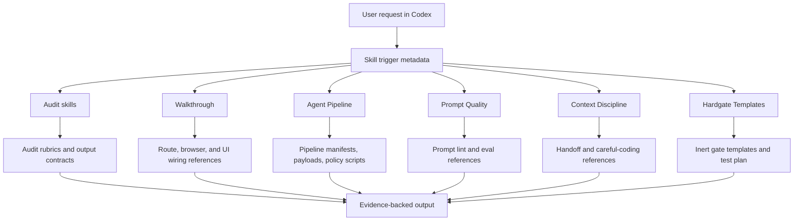
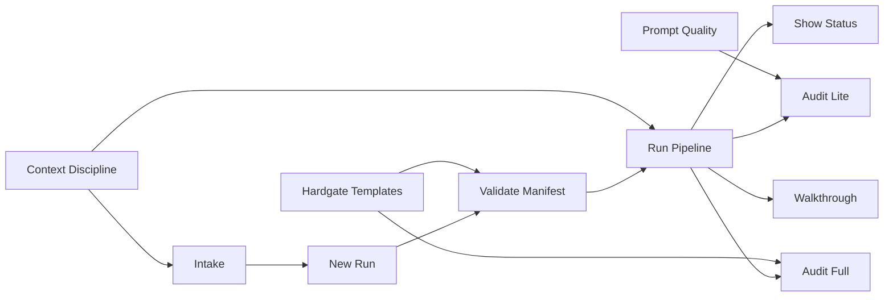

# ScottDevSkills User Manual

Version: **v0.1b**

ScottDevSkills is a Codex plugin for evidence-first development work. It gives
Codex a set of focused operating procedures for audits, UI walkthroughs,
manifest-driven pipeline runs, prompt quality checks, context discipline, and
optional gate design.

The suite is built around one principle: confidence should come from evidence,
not from polished narration. A ScottDevSkills workflow should leave behind a
clear account of what was inspected, what was verified, what failed, what is
still unknown, and what should happen next.

## Installation

ScottDevSkills is distributed as a Codex marketplace plugin.

### Codex App Install

1. Open the Codex plugin marketplace flow.
2. Add the marketplace repository `scottconverse/scottdevskills-suite`.
3. Install the plugin named `scott-dev-skills`.
4. Start a fresh Codex thread so the installed skills are loaded into the
   session.

### CLI Install

For a first-time CLI install, add the marketplace and then install the plugin:

```powershell
codex plugin marketplace add scottconverse/scottdevskills-suite --ref main --sparse .agents/plugins/marketplace.json --sparse plugins/scott-dev-skills
codex plugin add scott-dev-skills@scottdevskills
```

If the `scottdevskills` marketplace is already configured, the plugin install is
one command:

```powershell
codex plugin add scott-dev-skills@scottdevskills
```

After installing, start a fresh Codex thread. Existing threads keep the skill
list they loaded when the thread started.

### Install Troubleshooting

- If Codex does not show the skills immediately, start a fresh thread.
- If the marketplace is already configured, install the plugin directly from
  `scottdevskills`.
- If a stale beta remains installed, uninstall `scott-dev-skills@scottdevskills`
  and install it again from the same marketplace.
- The plugin id is `scott-dev-skills@scottdevskills`.

## Architecture Overview

ScottDevSkills is packaged as a Codex marketplace plugin. The plugin contains
skill entrypoints, shared references, pipeline payloads, and lightweight
validation metadata.



The plugin uses progressive disclosure:

- **Skill metadata** decides when a skill should load.
- **SKILL.md** provides the active workflow.
- **References** hold detailed rubrics, templates, and checklists.
- **Pipeline payloads** provide reusable manifests, roles, and policy scripts.
- **Regression cases** document expected trigger behavior.

## How The Skills Work Together

The skills are designed to cover different parts of a development lifecycle.



Common combinations:

- Use **Context Discipline** before broad implementation work to reduce
  scope/context risk.
- Use **Intake**, **New Run**, and **Validate Manifest** to convert intent into
  a controlled pipeline run.
- Use **Run Pipeline** for structured execution.
- Use **Audit Lite** between small fixes.
- Use **Walkthrough** when the product surface is a UI.
- Use **Audit Full** before release or handoff.
- Use **Prompt Quality** whenever prompt behavior is part of the product.
- Use **Hardgate Templates** when a repeated failure should become a policy or
  preflight check.

## Technical Model

ScottDevSkills is not a separate runtime. It does not add a background service.
It changes how Codex approaches a task after a skill is triggered.

### Package Structure

- `.agents/plugins/marketplace.json` exposes the plugin to Codex as a
  marketplace entry.
- `plugins/scott-dev-skills/.codex-plugin/plugin.json` declares plugin metadata,
  version, capabilities, and skill location.
- `plugins/scott-dev-skills/skills/*/SKILL.md` contains the active skill
  instructions.
- `plugins/scott-dev-skills/skills/*/references` contains skill-specific
  reference material.
- `plugins/scott-dev-skills/references` contains shared evidence standards,
  output contracts, migration notes, and trigger cases.
- `plugins/scott-dev-skills/tests/skill-regression/cases.json` records expected
  trigger behavior.

### Execution Behavior

Most skills are procedural. They tell Codex what to inspect, what evidence to
collect, how to classify findings, and what output shape to produce.

Pipeline skills can create or update project files when the user asks for
pipeline setup, run scaffolding, or execution. Audit and walkthrough skills
default to read-only review unless the user explicitly asks for repair work.
Hardgate Templates are inert by default.

### Evidence Standards

A finding should normally identify:

- Affected file, route, workflow, prompt, run artifact, or UI element.
- Expected behavior.
- Observed behavior or concrete risk.
- Impact.
- Likely cause when supportable.
- Suggested fix or test.

If evidence is incomplete, the skill should call that out instead of upgrading
an assumption into a defect.

## Skill Reference

### Audit Lite

**Purpose:** fast review of a small change.

Use Audit Lite for a bug fix, scoped diff, a few touched files, or a pre-merge
sanity check. It reads the changed surface, follows nearby callers and tests,
checks likely blast radius, and reports findings first.

Best for:

- Small bug fixes.
- Focused pull requests.
- Quick readiness checks between iterations.
- Verifying that a targeted fix did not create an obvious regression.

Output should be brief: severity-ranked findings, file/line evidence where
available, residual risks, and test gaps.

Use **Audit Full** instead when the change touches a release boundary,
architecture, data migration, security-sensitive behavior, or multiple
subsystems.

### Audit Full

**Purpose:** broad release and readiness review.

Audit Full reviews a project through engineering, UI/UX, documentation, testing,
and QA lenses. It is intended for release gates, handoffs, readiness reviews,
and adversarial second opinions.

Best for:

- Release readiness.
- Customer or leadership handoff.
- Whole-repo quality review.
- Finding risks across code, docs, tests, and runtime behavior.

Output should include an executive verdict, severity-ranked findings, role
deep dives, blast-radius analysis, this-sprint punch list, next-sprint
watchlist, and verification summary.

### Walkthrough

**Purpose:** determine whether a UI is actually wired.

Walkthrough combines browser exploration with source inspection. It checks
routes, visible controls, forms, modals, state changes, desktop/mobile layouts,
console errors, network failures, persistence, auth assumptions, and test
coverage.

Best for:

- Frontend readiness checks.
- Product walkthroughs.
- Finding cosmetic UI that is not backed by real behavior.
- Verifying forms, buttons, menus, and navigation.

Output should include route/workflow coverage, runtime evidence, UI wiring
verdict, console/network issues, persistence/auth notes, and suggested tests.

### Agent Pipeline

**Purpose:** route structured pipeline work to the correct stage skill.

Agent Pipeline is the suite's router for manifest-driven work. It selects the
right pipeline stage rather than doing everything itself.

Use it when the user asks to initialize, create, validate, run, resume, inspect,
or scaffold pipeline work.

### Pipeline Init

**Purpose:** prepare a repository for repeatable pipeline runs.

Pipeline Init adds project-side materials such as templates, policy scripts,
run directory conventions, and starter guidance. It is setup work. It should
not execute a run unless the user explicitly asks for execution afterward.

### Intake

**Purpose:** turn loose intent into durable pipeline input.

Intake captures a task without starting execution. It is useful when an idea is
real but not yet ready to run. A good intake records goal, constraints, success
criteria, likely run type, risks, and open decisions.

### New Run

**Purpose:** create a fresh pipeline run skeleton.

New Run chooses the appropriate template, creates the run structure, and
prepares manifest/scope-lock materials. It stops before execution.

### Validate Manifest

**Purpose:** check a pipeline run before it moves.

Validate Manifest catches schema errors, missing fields, path issues, scope
lock mismatches, and policy-shape problems. It reports pass/fail, blockers,
warnings, affected fields, and minimum repair steps.

### Run Pipeline

**Purpose:** execute or resume a manifest-driven run.

Run Pipeline follows the manifest, respects scope locks and human gates, runs
policy and verification stages, records evidence, and stops at gates, failures,
or unclear scope.

### Show Run Status

**Purpose:** inspect a pipeline run without changing it.

Show Run Status summarizes run id, current stage, last completed stage,
blockers, required decisions, and next valid action. It is intentionally
read-only.

### Audit Init

**Purpose:** create audit-handoff infrastructure.

Audit Init scaffolds audit protocols, audit gates, and five-lens self-audit
materials. It prepares the project for future review discipline; it does not
perform the audit itself.

### Prompt Quality

**Purpose:** make prompt behavior testable.

Prompt Quality reviews prompts and prompt-driven workflows for ambiguity,
conflicting instructions, missing output contracts, hidden context assumptions,
injection exposure, tool-use hazards, and untestable claims.

Best for:

- Prompt linting.
- Eval case design.
- Regression tests for known failures.
- Prompt release review.
- Checking downstream schema/parser compatibility.

Output should include prompt risks, suggested edits when useful, test/eval
cases, and remaining uncertainty.

### Context Discipline

**Purpose:** keep long or complex sessions coherent.

Context Discipline manages context pressure, large output, handoffs, and
careful pre-edit analysis. It favors targeted reads, durable artifacts,
summaries, search-first exploration, and explicit handoff state.

It also contains the careful-coding behavior: trace callers, runtime paths,
data contracts, render paths, persistence paths, tests, and blast radius before
non-trivial edits.

Best for:

- Long sessions.
- Large logs or command output.
- Broad implementation work.
- Handoffs.
- High-risk edits.

### Hardgate Templates

**Purpose:** design enforcement without surprise enforcement.

Hardgate Templates helps design policy checks, final-response checks, preflight
scripts, hook templates, or release gates. In v0.1b, these templates are inert
unless a later implementation task installs active enforcement.

Best for:

- Repeated failure patterns.
- Release gates.
- Policy check design.
- Behavioral tests for compliance.

## Choosing The Right Skill

| Situation | Use |
| --- | --- |
| One small fix needs review | Audit Lite |
| Whole project needs readiness review | Audit Full |
| UI may be cosmetic or partially wired | Walkthrough |
| Project work needs scope locks and stages | Agent Pipeline |
| A task idea needs capture before execution | Intake |
| A run exists but needs preflight | Validate Manifest |
| A run should move forward | Run Pipeline |
| A run needs read-only status | Show Run Status |
| Prompt behavior changed | Prompt Quality |
| Session context is becoming a risk | Context Discipline |
| A recurring failure needs a gate design | Hardgate Templates |

## Operating Guidance

- Start with the narrowest skill that matches the task.
- Do not use audit skills as repair skills unless repair is explicitly
  requested.
- Prefer runtime evidence when reviewing UI behavior.
- Prefer regression cases when reviewing prompts.
- Prefer manifests and scope locks for work that spans multiple stages.
- Preserve uncertainty instead of overstating findings.

## Beta Notes

ScottDevSkills v0.1b is an early beta. The plugin is installable and validated,
and its workflows are intentionally conservative. The next improvements should
come from real use: better trigger regression cases, sharper output contracts,
and examples from successful audits, walkthroughs, and pipeline runs.
