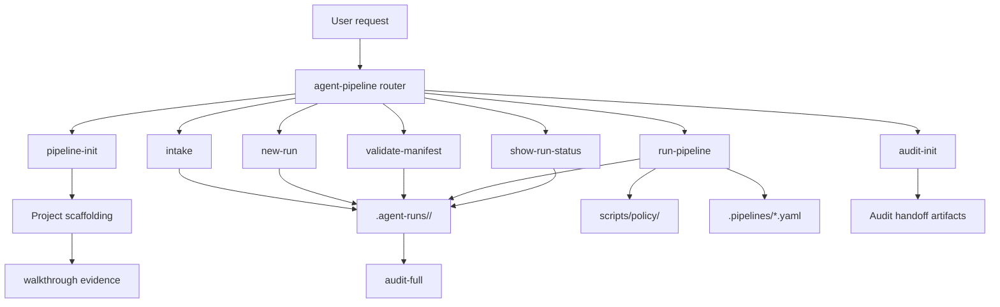

# ScottDevSkills Agent Pipeline Architecture

## Layers



## Package Layout

The suite ships the pipeline as normal Codex skills plus a compact payload:

```text
plugins/scott-dev-skills/
  .codex-plugin/plugin.json
  skills/
    agent-pipeline/
    pipeline-init/
    intake/
    new-run/
    validate-manifest/
    run-pipeline/
    show-run-status/
    audit-init/
  p/
    p/   # pipeline YAML, roles, templates copied to .pipelines/
    s/   # policy scripts copied to scripts/policy/
```

The short `p/` package path is deliberate. It keeps the marketplace checkout
safe on Windows while letting initialized projects receive readable target
paths.

## Runtime Model

1. The router selects the smallest applicable stage skill.
2. `pipeline-init` copies bundled pipeline definitions and policy scripts into
   the target repo.
3. `new-run` or `intake` creates a durable run directory.
4. `validate-manifest` checks schema and scope before execution.
5. `run-pipeline` advances stages in YAML order and appends to `run.log`.
6. `show-run-status` reads the same artifacts without mutating them.
7. `audit-full` can audit the repo and run artifacts after or during delivery.

## State Files

Initialized projects use:

- `.pipelines/` for pipeline definitions, templates, and role prompts.
- `scripts/policy/` for local policy checks.
- `.agent-runs/<run-id>/manifest.yaml` for the run contract.
- `.agent-runs/<run-id>/scope-lock.yaml` for canonical scope facts.
- `.agent-runs/<run-id>/run.log` for append-only stage history.
- `.agent-runs/<run-id>/*-report.md` for stage evidence.

## Control Loop

The control loop separates completion evidence from stop permission. A run may
have a successful push or green CI and still need to continue if the manifest
authorizes additional work. Valid stops require a named gate or blocker.

Stop categories include human approval, failed policy, destructive action,
credential need, scope conflict, unavailable external dependency, explicit user
pause, or all stages complete with the final response gate satisfied.

## Policy Scripts

The bundled policy scripts check manifest shape, allowed paths, scope lock,
release-doc consistency, plan/directive conformance, action budgets, TODO
policy, and final-response control state. They are ordinary project files after
initialization, so teams can inspect and version changes.

## Audit Handoff

The pipeline produces evidence. It does not replace audit judgment.

- `audit-lite` is appropriate for small diffs.
- `audit-full` reads the repo, run artifacts, tests, docs, and UI evidence for
  a full release-readiness verdict.
- `audit-init` adds dual-agent handoff artifacts when one agent implements and
  another audits.

## Regression Boundaries

Suite validation protects this architecture by checking:

- Canonical skill names only.
- Required references and templates exist.
- Public manifest metadata matches the beta release.
- Active docs do not contain stale standalone product names.
- Package-relative file paths stay short enough for Windows marketplace
  installs.
